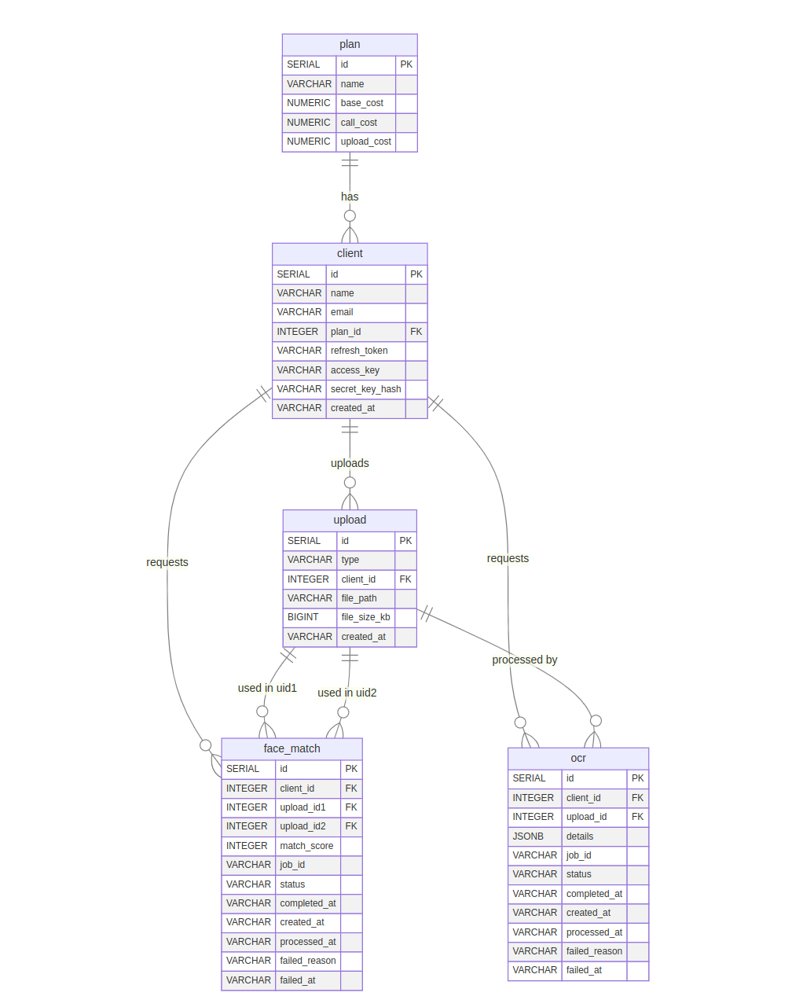

# eKYC Exercise

A fully featured REST API for an online KYC (Know Your Customer) system. This includes REST APIs, a relational database, caching, a message broker, asynchronous workers, and file storage. Additionally, a cron job generates reports on clients, their usage patterns, costs, etc., on a daily and monthly basis.

---

## Tech Stack

- **Backend**: Golang (Gin Framework)  
- **Database**: PostgreSQL  
- **File Store**: MinIO  
- **Message Broker**: RabbitMQ  
- **Cache**: Redis  

---

## Architecture Diagram


---

## ERD Diagram



---

## Features

- Client Signup  
- File Upload  
- Operations: Face Match and OCR  
- Retrieve Operation Results  
- Daily and Monthly Reports  

---

## Prerequisites

- **Golang**: 1.23.2  
- **Docker**: 27.3.1  

---

## Running the Application

1. **Clone the repository**:
   ```bash
   git clone https://github.com/justsushant/go-ekyc
   ```

2. **Set environment variables**:  
   Create a `.env` file based on `.env-example` and set it in Makefile run command.

3. **Launch the application and dependencies**:
   ```bash
   make run
   ```

4. **Apply migrations**:  
   Use the following commands to force the latest migration on the database:
   ```bash
   make create-migrate
   bin/migrate -v 5 -f
   ```

5. **Connect to the server**:  
   Use any HTTP client to access the server at the host specified in the `.env` file.

---

## Endpoints

| Route                            | Method | Description              |
| -------------------------------- | ------ | ------------------------ |
| `/api/v1/health`                 | GET    | Health Check             |
| `/api/v1/upload`                 | POST   | File Upload              |
| `/api/v1/face-match-async`       | POST   | Face Match Operation     |
| `/api/v1/ocr-async`              | POST   | OCR Operation            |
| `/api/v1/result`                 | GET    | Get Operation Result     |

[Download Postman Collection](docs/go-ekyc.postman_collection.json)

---

## Testing

### Unit Tests

Run the following command to execute unit tests:
```bash
make test
```

### Integration Tests

Run the following command to execute integration tests:
```bash
make test-integration
```

### Load Tests

There are two scenarios for load test whose results are saved in `testdata` directory.<br>
Details of the load test:
    - Duration: 45s
    - Max users: 5000
    - Max concurrent users: 120

-  Face Match Scenario<br><br>Run the following command to execute load tests:
    ```bash
    make load-test-face
    ```

    Metrics collected during load tests:  
    - **Machine Specs**: Dell XPS 13, Intel© Core™ i7-8550U CPU, 16 GB RAM
    - **Median Latency**: 2.2s
    - **p95 Latency**: 3.7s 
    - **p99 Latency**: 4.3s
    - **Throughput**: 58

-  OCR Scenario<br><br>Run the following command to execute load tests:
    ```bash
    make load-test-ocr
    ```

    Metrics collected during load tests:  
    - **Machine Specs**: Dell XPS 13, Intel© Core™ i7-8550U CPU, 16 GB RAM
    - **Median Latency**: 1.9s
    - **p95 Latency**: 3.1s 
    - **p99 Latency**: 3.7s
    - **Throughput**: 53  


---

## Test Coverage

To check test coverage, run:
```bash
make test-coverage
```

Metrics collected:  
- **Total Coverage**: 25.3%  
- **Files Coverage Breakdown**:
    1. Handler package: 68.3%
    2. Service package: 27%
    3. Cronjob package: 35.4%

---

## Documentation

Access the OpenAPI Swagger Docs at:
```
/swagger/index.html
```