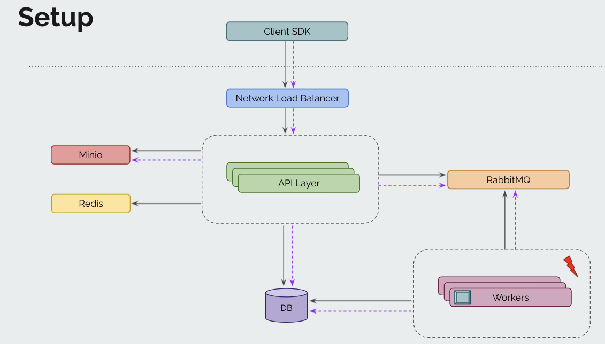

# eKYC Exercise

A fully featured REST API for an online KYC (know your customer) system. This will include REST APIs, relational DB, caching, message broker, async workers and file store. There is also a cronjob which is used to generate reports regarding clients, their usage patterns, costs etc on a daily and monthly basis.

## Tech Stack

- Backend: Golang, Gin Framework
- Database: PostgreSQL
- File Store: Minio
- Message Broker: Rabbitmq
- Cache: Redis

## Architecture Diagram



## Features

- Signup the client
- Upload files
- Perform operations like, Face Match and OCR
- Checking results of mentioned operations
- Daily and Monthly reports

## Running the application

1. Clone the repository:

   `git clone https://github.com/justsushant/go-ekyc`

2. Set the required environment variables in .env file.
   See .env-example for reference.

3. Run the command below to launch the app and its associated dependencies.
   ```
   make run
   ```
4. Run the command below to apply the necessary migrations.
   Below command forces the latest migration on the database.
   ```
   make create-migrate
   bin/migrate -v 5 -f
   ```
5. Connect to the server on host specified in the .env file using any HTTP client

## Endpoints

| Routes                          | Description             |
| ------------------------------- | ----------------------- |
| /api/v1/health [GET]            | Health check            |
| /api/v1/upload [POST]           | File upload             |
| /api/v1/face-match-async [POST] | Face match operation    |
| /api/v1/ocr-async [POST]        | OCR operation           |
| /api/v1/result [GET]            | Result of the operation |

[Download Postman Collection](docs/go-ekyc.postman_collection.json)

## Testing

- Run the below command to run the tests

  `make test`

## Docs

- Visit the below endpoint to see the OpenAPI Swagger Docs

  `/swagger/index.html`
